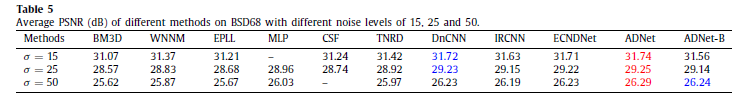
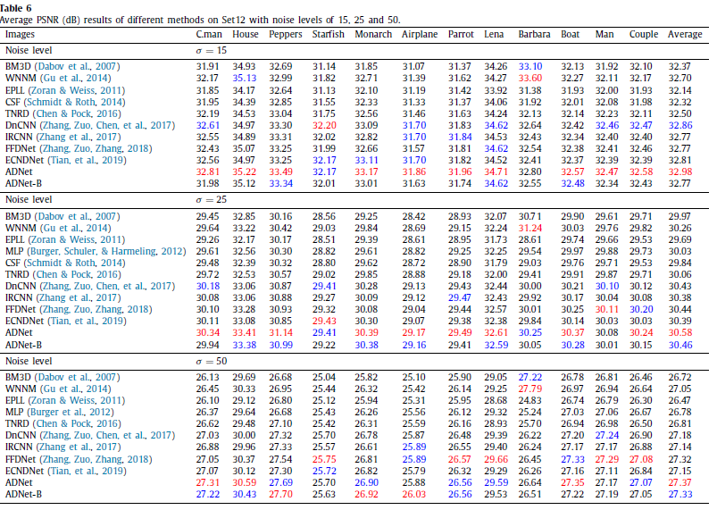
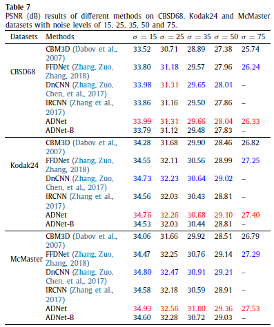
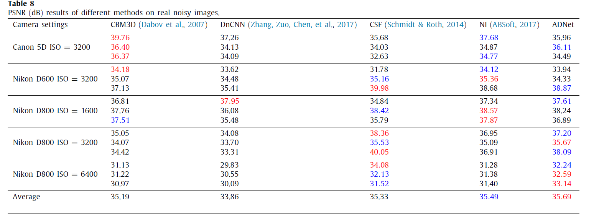
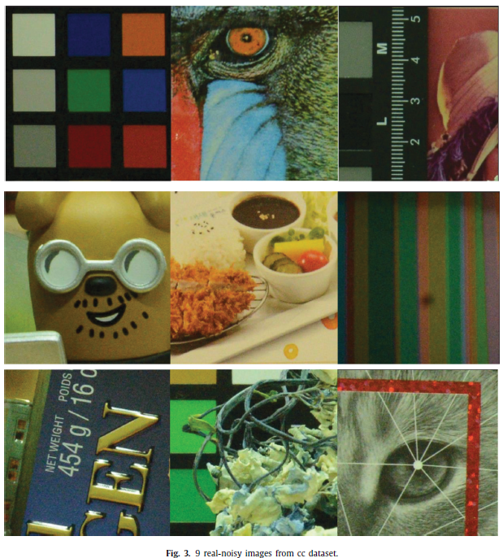
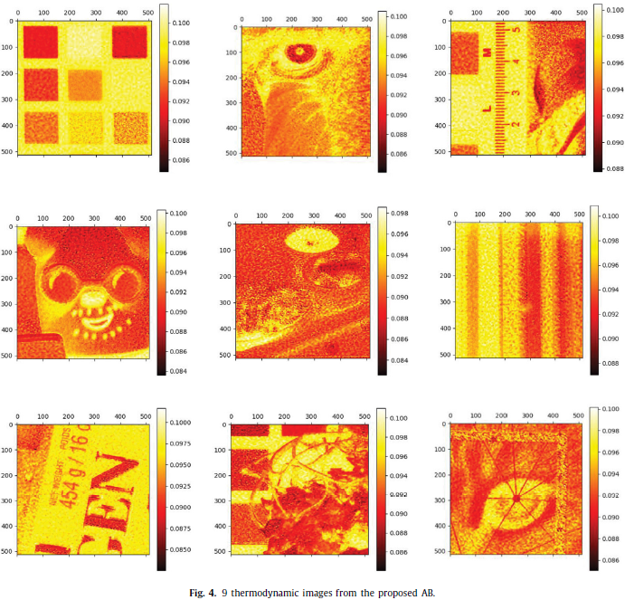
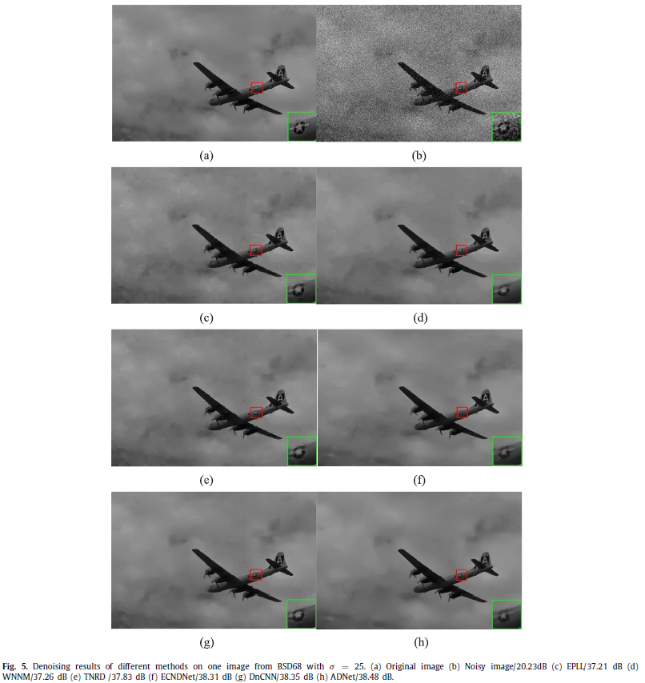
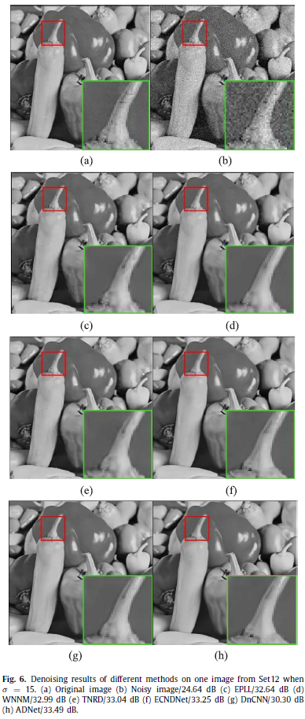
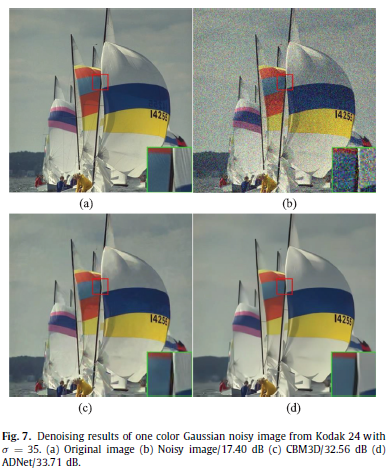
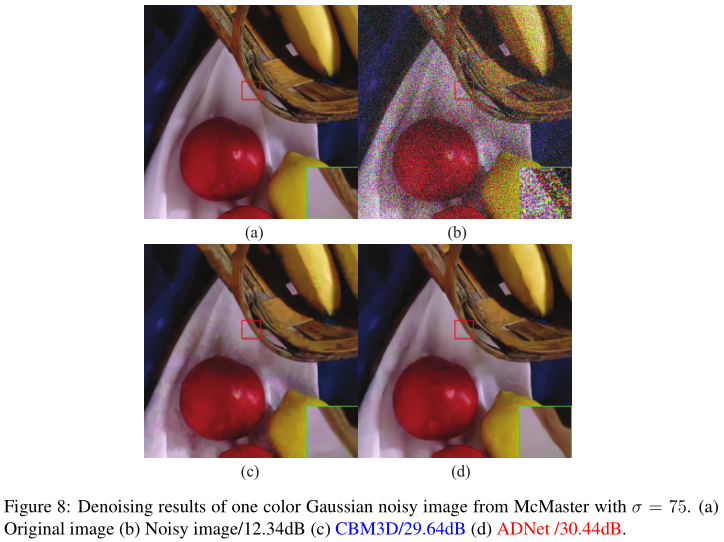

## Atention-guided CNN for image denoising（ADNet）by Chunwei Tian, Yong Xu, Zuoyong Li, Wangmeng Zuo, Lunke Fei and Hong Liu is publised by Neural Networks, 2020 (https://www.sciencedirect.com/science/article/pii/S0893608019304241) and it is implemented by Pytorch.

## This paper is pushed home page of the Nueral Networks. Also, it is reported by wechat public accounts at  https://mp.weixin.qq.com/s/Debh7PZSFTBtOVxpFh9yfQ and https://wx.zsxq.com/mweb/views/topicdetail/topicdetail.html?topic_id=548112815452544&group_id=142181451122&user_id=28514284588581&from=timeline.

## Absract
#### Deep convolutional neural networks (CNNs) have attracted considerable interest in low-level computer vision. Researches are usually devoted to improving the performance via very deep CNNs. However, as the depth increases, influences of the shallow layers on deep layers are weakened. Inspired by the fact, we propose an attention-guided denoising convolutional neural network (ADNet), mainly including a sparse block (SB), a feature enhancement block (FEB), an attention block (AB) and a reconstruction block (RB) for image denoising. Specifically, the SB makes a tradeoff between performance and efficiency by using dilated and common convolutions to remove the noise. The FEB integrates global and local features information via a long path to enhance the expressive ability of the denoising model. The AB is used to finely extract the noise information hidden in the complex background, which is very effective for complex noisy images, especially real noisy images and bind denoising. Also, the FEB is integrated with the AB to improve the efficiency and reduce the complexity for training a denoising model. Finally, a RB aims to construct the clean image through the obtained noise mapping and the given noisy image. Additionally, comprehensive experiments show that the proposed ADNet performs very well in three tasks (i.e. synthetic and real noisy images, and blind denoising) in terms of both quantitative and qualitative evaluations. The code of ADNet is accessible at https://github.com/hellloxiaotian/ADNet.

## Requirements (Pytorch)  
#### Pytorch 0.41
#### Python 2.7
#### torchvision 
#### openCv for Python
#### HDF5 for Python

## Commands
### Training
### Training datasets 
#### The  training dataset of the gray noisy images is downloaded at https://pan.baidu.com/s/1nkY-b5_mdzliL7Y7N9JQRQ or https://drive.google.com/drive/folders/1m1zVFJwj761M563YCMocwIjLLATat3ak (google drive)
#### The  training dataset of the color noisy images is downloaded at https://pan.baidu.com/s/1ou2mK5JUh-K8iMu8-DMcMw (baiduyun) or https://drive.google.com/file/d/1S1_QrP-fIXeFl5hYY193lr07KyZV8X8r/view?usp=sharing (google drive) 

### Train ADNet-S (ADNet with known noise level)
#### python train.py --prepropcess True --num_of_layers 17 --mode S --noiseL 25 --val_noiseL 25    

### Train ADNet-B (DnCNN with blind noise level)
#### python train.py --preprocess True --num_of_layers 17 --mode B --val_noiseL 25

### Test 
### Gray noisy images
#### python test.py --num_of_layers 17 --logdir g15 --test_data Set68 --test_noiseL 15 
### Gray blind denoising
#### python test_Gb.py --num_of_layers 17 --logdir gblind --test_data Set68 --test_noiseL 25   

### Color noisy images
#### python test_c.py --num_of_layers 17 --logdir g15 --test_data Set68 --test_noiseL 15 
### Color blind denoising
#### python test_c.py --num_of_layers 17 --logdir cblind --test_data Set68 --test_noiseL 15  

### Network architecture

### Test Results
#### 1. ADNet for BSD68

#### 2. ADNet for Set12

#### 3. ADNet for CBSD68, Kodak24 and McMaster

#### 4. ADNet for CBSD68, Kodak24 and McMaster

#### 5. Running time of ADNet for a noisy image of different sizes.

#### 6. Complexity of ADNet

#### 7. 9 real noisy images

#### 8. 9 thermodynamic images from the proposed A

#### 9. Visual results of BSD68

#### 10. Visual results of Set12

#### 11. Visual results of Kodak24

#### 12. Visual results of McMaster 

### If you cite this paper, please the following format:  
#### 1.Tian C, Xu Y, Li Z, et al. Attention-guided CNN for image denoising[J]. Neural Networks, 2020, 124,177-129.  
#### 2.@article{tian2020attention,
####  title={Attention-guided CNN for image denoising},
####  author={Tian, Chunwei and Xu, Yong and Li, Zuoyong and Zuo, Wangmeng and Fei, Lunke and Liu, Hong},
####  journal={Neural Networks},
#### volume={124},
#### pages={177--129},
####  year={2020},
####  publisher={Elsevier}
####  }
